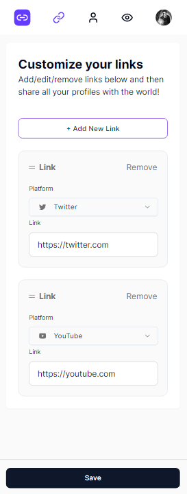
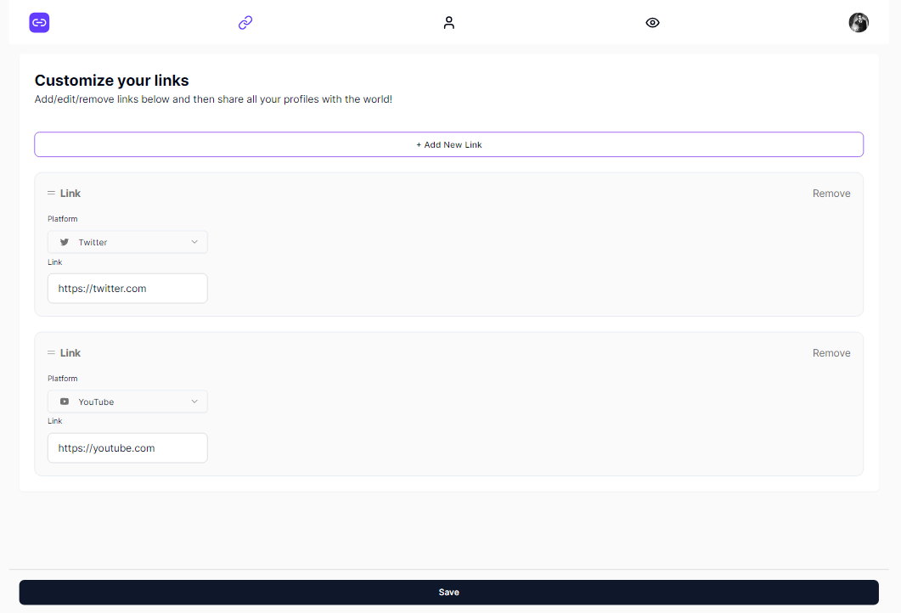

# This is a Link Sharing App

## Used Technologies

- React
- Next.js
- Nextjs(server actions)
- Clerk(auth)
- TypeScript
- Prisma
- Tailwind CSS
- MongoDB

## Description

this is a link sharing app. you can share your links with other people. you can also see other people's links.
You have to authenticate to use this app. you can authenticate with google or github.
i tried new nextjs feature server actions without api routes.
i used clerk for authentication. clerk is a new authentication service. it is very easy to use.

<!--  Picutre Preview -->

